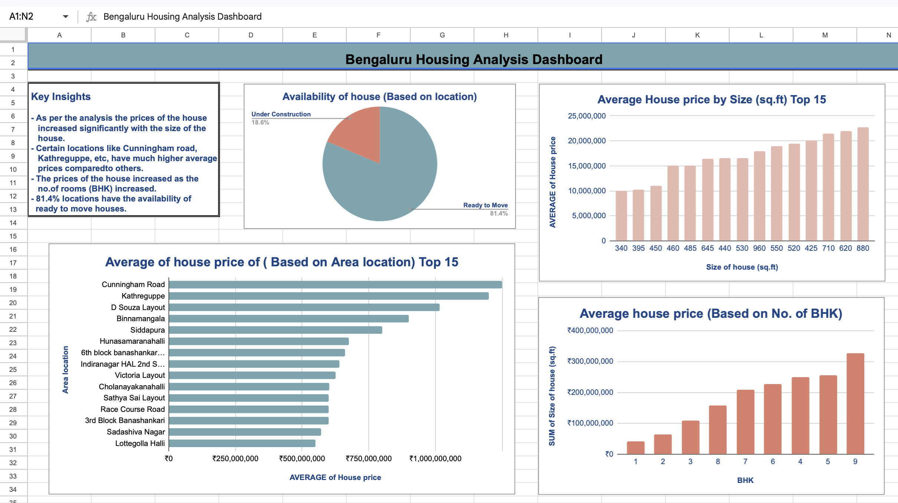
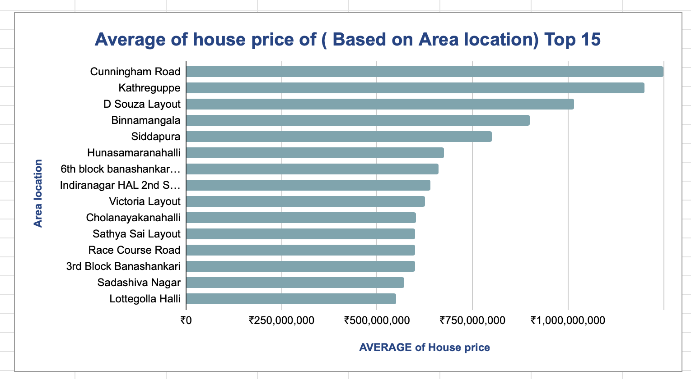
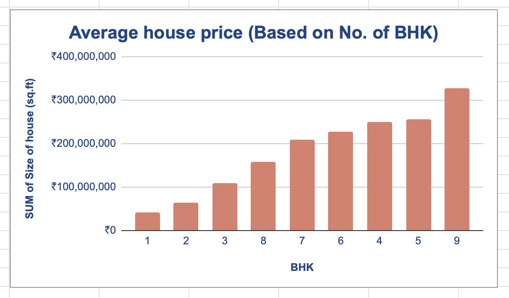
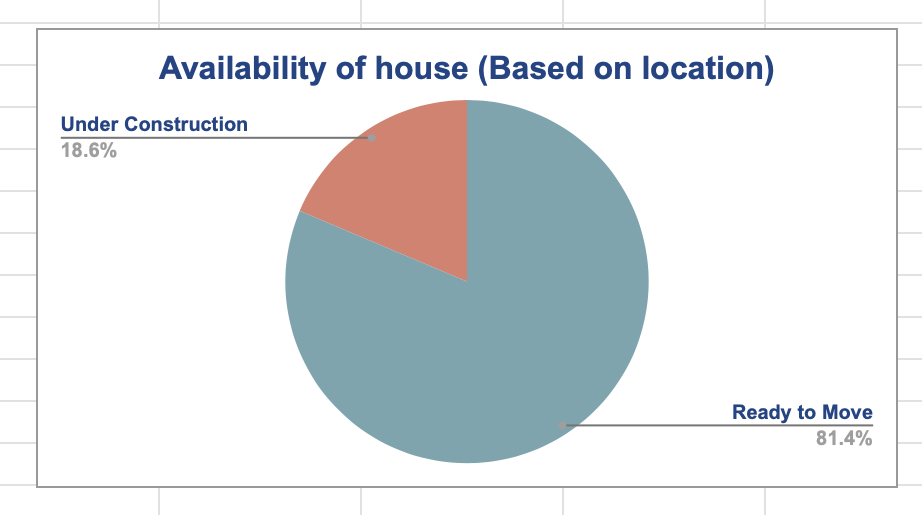

https://github.com/ShwetaRam0213/Bengaluru-Housing-Analysis-Excel/blob/3a5ced6732685bb89fbce11e6e29959ddb885bb8/ChatGPT%20Image%20Mar%2030%2C%202026%20at%2007_03_13%20PM.png
## 🏠 Bangalore Housing Price Analysis (Excel Dashboard)

### 📊 Overview
This project analyzes housing data from Bangalore to identify price trends based on location, size, and number of bedrooms (BHK). A dashboard was created using Microsoft Excel to visualize key insights.

---

### 🔗 Live Dashboard
[Click here to view the full project on Google Sheets]
(https://docs.google.com/spreadsheets/d/1BQy-bzYSnDCQ5o1IZHmfE6-Lk2BsWrXtr07c9B2OSg0/edit?usp=sharing)

---

### 🛠 Tools Used
- Microsoft Excel  
- Pivot Tables  
- Data Visualization (Charts & Dashboard)

---

### 📈 Key Insights
- House prices increase significantly with property size (sq.ft)
- Premium locations like Cunningham Road and Kathreguppe have higher average prices
- Price increases consistently with number of BHK
- Around 81% of properties are ready-to-move

---

### 📸 Dashboard Preview

---

### 🚀 Conclusion
This project demonstrates strong Excel skills including data analysis, dashboard creation, and deriving meaningful insights from real estate data.
